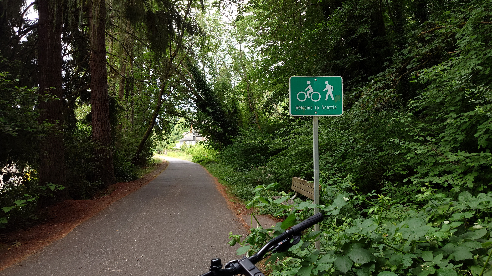
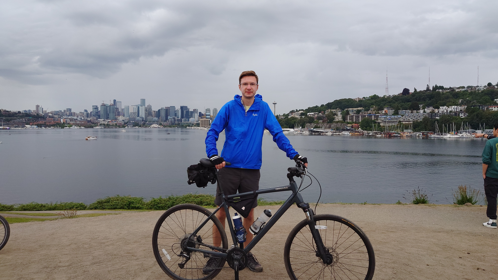
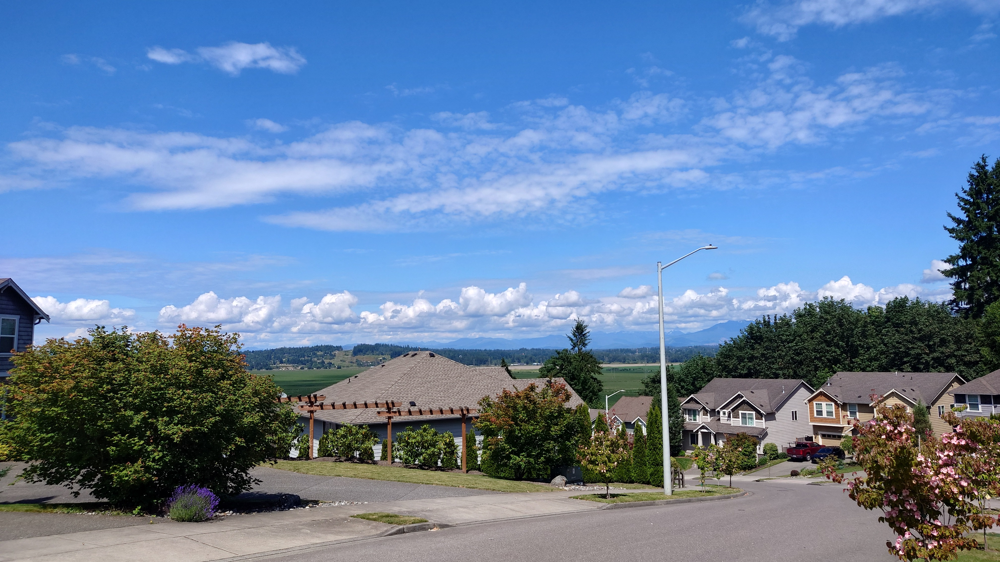
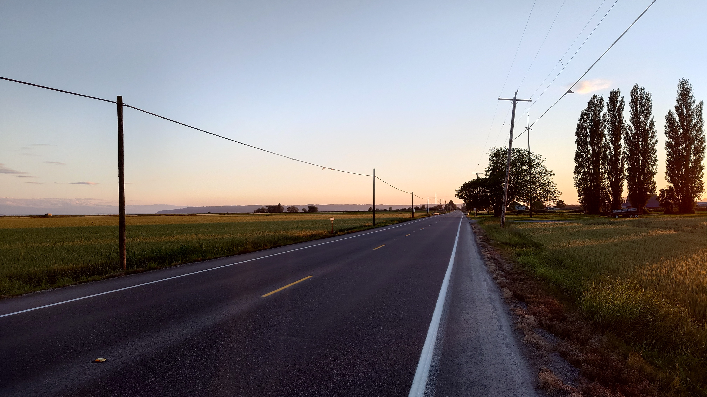

# FREN 401

## 1. Comment voyager en vélo
> Le conseil pour voyager de Vancouver à Seattle en vélo.

Cet été j'ai fait du vélo à Seattle.
Je suis parti de Vancouver à Juin 28 matin, entré Seattle le soir prochain, et retourné à Vancouver à Juillet 3.
Quelle voyagé c'était ! 4 jours à vélo et 580 km au total !

Voici mon conseil pour prendre ce voyage.

Tout d'abord, il faut préparer votre vélo et bagage en avance.
Pour le vélo, c'est important de le nettoyer: les dérailleurs, la cassette et la chaîne doivent être propres et bien lubrifiés.

En parlant de bagage, je conseil que vous preniez le minimum parce que ce sera plus difficile à rouler en portant un sac à dos gros.
Si vous voyagez seulement pour quelques jours, ces choses sont tout dont vous avez besoin:
- En peu de nourriture, vous pouvez vous arrêtez pour bien manger dans les restaurants en route.
- L'eau, au moins 1 litre.
- Important ! Lubrifiant pour chaîne.
- Vêtement supplémentaire, vous pouvez faire la lessive dans les hôtels.
- Trucs d'hygiène.

Ensuite, il est nécessaire de planifier la route.
Je conseil que vous évitiez des autoroutes mais preniez les routes des campagnes autant que possible.
Bien qu'ils peuvent être plus longs, je trouve qu'ils sont formidables: très jolies, tranquilles et bien pour découvrir la région.

Voici la carte que j'ai suivie: [le lien pour la route](https://ridewithgps.com/routes/10406269?lang=en).

À voir ! Il peut prendre 1 heure pour traverser la frontière canadienne, donc planifier pour ça.

|  |  |
| ---------------------------------------------- | ---------------------------------------------- |
|  |  |

Alors, je vous souhaite un voyage génial ! Choisissez une semaine quand il fait bon !

