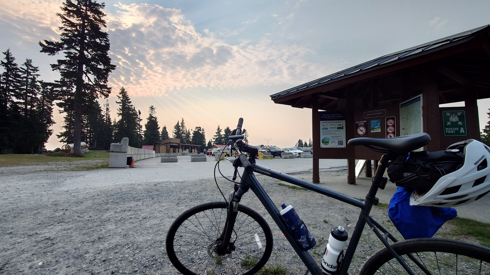
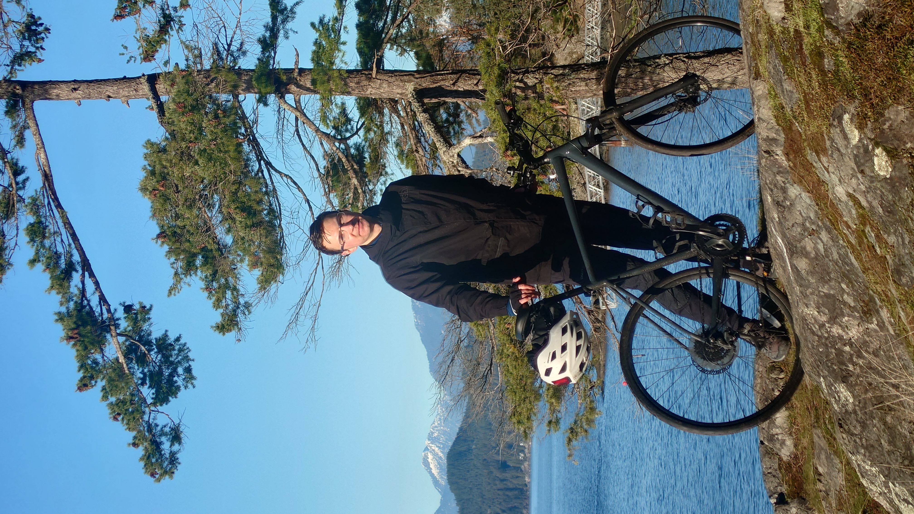
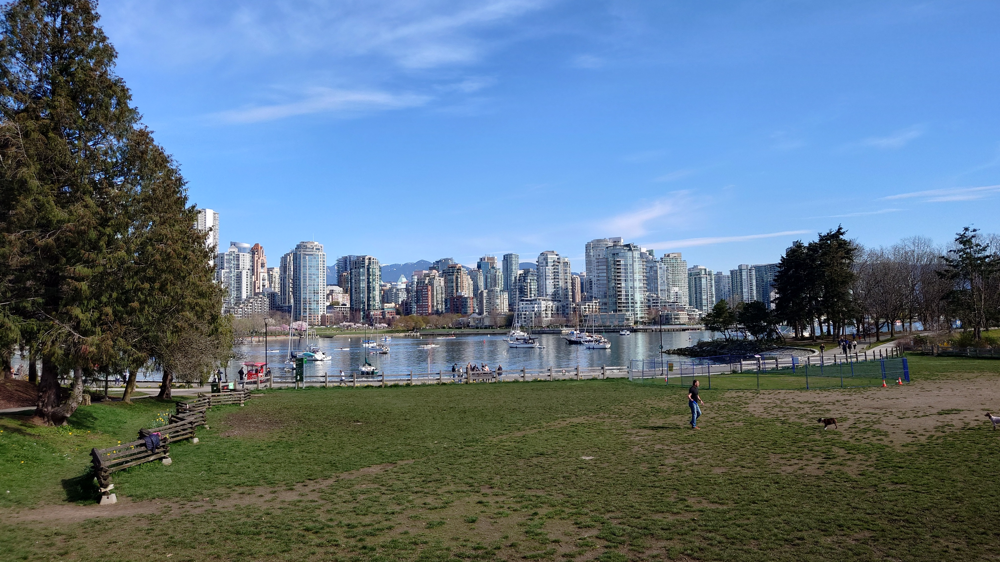

# FREN 402

## 1. Le meilleur temps pour faire du vélo

> Les conseils pour les cyclistes.

Le meilleur temps pour commencer un voyage à vélo est le matin vraiment tôt, à l'aube à environ 5-6 heures du matin.
Il y a quelques raisons pour ça et je voudrais vous les présenter.

Tout d'abord, je doute qu'on puisse trouver le temps plus magique pour faire du vélo.
L'ambiance est vraiment calme parce qu'on ne rencontre ni voitures ni beaucoup de gens dans les rues à ce temps-là.
Donc, on peut revisiter les rues familières et les rencontrer différemment, sans bruit et sans l'atmosphère de hâte.

Aussi, il me semble qu'en commencent si tôt, on obtient l'inspiration pour faire les voyages plus longs.
Si on part à 5h du matin le dimanche, on a 4 ou 5 heures pour visiter les endroits loin sans se précipiter.
De plus, quand on retourne chez eux, on peut continuer la journée avec les autres qui s'est déjà réveillé.

Ainsi, bien qu'il puisse sembler difficile de se réveiller si tôt pour faire du vélo, je suis sûre qu'après on l'essaye, on va tomber amoureux de ça.

## 2. Le tour de vélo le plus difficile à Vancouver

> La description de voyage sur l'île Bowen.

Quelques mois plus tard, j'ai découvert l'île Bowen en y faisant du vélo. Il faut comprendre que ce jour-là, c'était mon premier voyage sur cette île, donc j'était curieux de la découvrir. J'ai pensé que ce serait un voyage calme et vraiment joli.

Mais, je suis devenu surpris presque en moment quand j'ai commencé de rouler. Bien que les rues soient calmes et avec beaucoup d'espace pour les cyclistes, la quantité des montées était la chose qui a causé des difficultés sérieuses. Chacun qui essayera d'y rouler va découvrir qu'il n'y a pas de rues sans une montée ou une descente dans cette île.

De plus, j'ai trouvé que les descentes en Bowen étaient assez dangereuses. Non seulement l'inclination était grande, mais aussi il y a eu beaucoup de tournées. Donc, tout le monde qui y fait du vélo doit être extrêmement prudent et freiner en avance.

Toutefois, cette île est fantastique pour faire du vélo avec des amis. C'était très amusant de se planter sur la quantité des montées et le manque de belles vues. Mais pour réparer la situation, l'île offre plusieurs grandes descentes. Par exemple, c'était vraiment amusant de prendre la rue centrale pour retourner au terminal maritime parce qu'elle a eu la descente la plus longue.

Ainsi, c'était un voyage fantastique. Cette île Bowen pose un challenge mais aussi crée une opportunité merveilleuse de passer un week-end génial.

## 3. Ma place préférée pour regarder la floraison des cerisiers

> La description d'une rue génial pour regarder la floraison des cerisiers.

C'est la rue Heather à Vancouver que j'aime visiter pendant le printemps pour regarder la floraison des cerisiers.

L'année dernière je l'ai découvert en faisant du vélo à Kerrisdale, et instantanément j'en suis tombé amoureux. Presque toute la rue entre les avenues W52 et W41 était détournée avec la floraison. C'était magique.

Donc, j'y suis allé cette année aussi en avril, mais étonnamment j'ai découvert que les arbres l'ont pas encore eu la floraison. J'ai oublié à quelle moins j'y étais allé l'année dernière, donc probablement je devais visiter cette rue en mai.

Pour les gens qui veulent y aller en vélo, je recommande de commencer à l'avenue W41 et rouler ou Sud vers l'avenue W52. Ce sera une descente, qui va être plus facile.

Ainsi, voilà ma rue préférée pour regarder la floraison des cerisiers. Je recommande de visiter cette rue Heather entre les avenue W52 et W41 pendant la fin d'avril ou la commence de mai pour voir les floraisons magiques.

